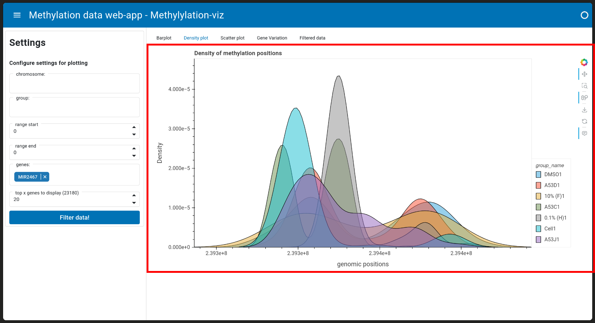

# Methylation-viz (V 0.1)

## Author
- Ramon Reilman, Hanze bfv2 ([Github](https://github.com/RamonReilman))

## App description
### Background information
Students at the medical research major are researching the impact of certain chemicals on the methylation of DNA.
DNA methylation is a very import process that happens in the body. It impacts the expression-levels of genes in the body.

One of the problems that the students were facing was processing and visualising the data they got from their research.
This is not only demotivating for the students, they would love to dive into their data and find interesting things. But since the data was to large and they did not have the promoter locations for all genes, they simply could not do this.

That is why this bioinfmatics and BMR team up is very import. Together we created a web-app that can be used by the students to dive into their data, and be able understand it better.

### Features
- Quickly get amount of methylations for a gene, per group
- Get a quick overview of the density of methylation points
- Look at all the methylation points, and compare them
- Gives a table that contains genes with a high variance in methylation positions

## Requirements
OS: Linux
Python: 3.11.2 or higher

### Data
I cannot share the data with others. If you do need to know the location of the data, (this is important for my reviewers that want to test the code) you can mail me.

### Libraries used
| Library                                        | Version | Description                                                                                                                                  |
|------------------------------------------------|---------|----------------------------------------------------------------------------------------------------------------------------------------------|
| [panel](https://github.com/holoviz/panel)      | 1.6.0   | Panel is an  open-source  Python library that lets you  easily build powerful tools, dashboards and complex applications entirely in Python. |
| [Polars](https://github.com/pola-rs/polars)    | 1.20.0  | Polars: Blazingly fast DataFrames in Rust, Python, Node.js, R, and SQL                                                                       |
| [Pandas](https://github.com/pandas-dev/pandas) | 2.2.3   | pandas: powerful Python data analysis toolkit                                                                                                |
| [hvplot](https://github.com/holoviz/hvplot)    | 0.11.2  | hvPlot makes data analysis and visualization simple                                                                                          |


## Installing
Clone the repo
```
git clone git@github.com:RamonReilman/app_methylation.git
cd app_methylation
```

Install the libraries used
```
pip3 install -r requirements.txt
```

Create a config.ini file
```
touch data/config.ini
```
To get the structure of the config file, look at [Config structure](readme.md###Config-structure)

Start up the app
```
panel serve src/ui.py
```

The website is hosted on:
theredmanplays.com/methylatie
There's a hosting plan found in the docs dir, if you want to host it yourself.


### Config structure
```
[PATHS]
data_folder = path/to/data_analysis/folder
annotated_bed = path/to/app_methylation/data/annotated_bed.bed
group_data = path/to/app_methylation/data/group_info.csv

top_genes = path/to/app_methylation/data/gene_variation.csv
info_page = path/to/app_methylation/data/use_page.md
```


## Usage
Loading into the page might take a minute, since it has to load all of the data.
### Data filtering
On the right side of the app a data filtering area can be found (in the red rectangle)


The following variables can be used to filter the dataset:

- chr, filter the data on chromosomes.
- group, specify which groups you want to see.
- range start, show all methylation points higher then this input
- range end, show all methylations lower then this input
- gene, select up to 5 genes, and get information about the promoter regions of these genes
- top x genes, this is the amount of rows the users wants to see of the gene variation table

After you filled in the filters, you press the "Filter data!" button to apply the filters on the data
A loading indicator will appear, the website will showcase the new plots when it is done filtering.

### Visualisations
The website offers a couple of data visualisations.

#### Barchart
This barchart will show the amount of methylated spots for all groups in the filtered dataframe. The group will only be visible in the plot if the n methylation count > 0.


On the x-axis will contain the group name, while the y-axis will show the amount of methylations the group has.
The mouse can be used to hover over a bar, to get the exact amount of methylations

#### Density plot
The density plot will visualise the density of methylation in the data.
This plot works best when only selecting 1 gene to look at.


The x-axis will contain the genomic position, the y-axis will showcase the density of methylation points

#### Scatter
The scatter plot is a way to look at each specific methylated point.
This plot will only work when atleast 1 gene is selected in the filter-box


This plot renders extremely slowly, and it is recommended to zoom with the box-zoom function (menu, right to the plot).
The x-axis will contain the genomic positons and the y-axis contains the chromosome the gene is on.

#### Gene variation
This is a table that contains the standard deviation of the positional data for every gene.
This is sorted descending, so these are the genes with the highest spread in position.


#### Filtered data
This will contain all of the data from the filtered dataframe


### Plot interactivity
The plots are interactive, meaning you can zoom and hover on stuff.
To get more information, look the settings to the right of the plots
You can also download and save the generated plots from here.


## Testing
Functions can be unit tested via the following command
```
python3 -m pytest
```

## Support
If any bugs are to be found, open up an issue on the [repo](https://github.com/RamonReilman/app_methylation/issues)
